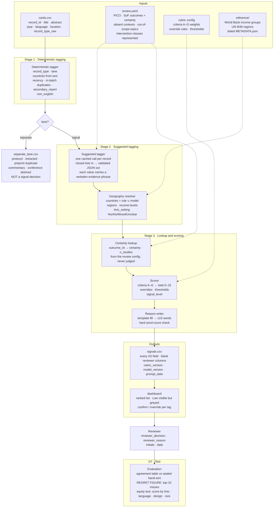
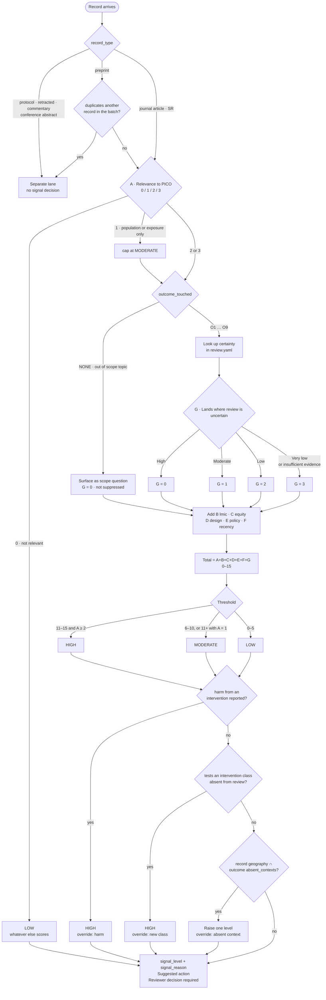

# Update Signal — information flow and decision tree

Living Evidence Update Signal · DESTINY Hackathon, Cape Town, 17–18 September 2026.
Source documents: H1 Participant Handout, H2 Rubric and Data Fields, H3 Summary of Findings.

## 1. What the tool does, in one line

Takes new records for a living systematic review, tags them, looks up how certain the review already is about the outcome each record touches, and ranks them High / Moderate / Low with a checkable fifteen-word reason. The reviewer decides; the tool suggests.

## 2. What the tool must never do

- Include or exclude studies, or decide whether the review needs updating.
- Assert an AI tag. Every model output is labelled *suggested* until a human confirms it.
- Hide Low records. They are visible and deprioritised.
- Infer outcome certainty. It is looked up from the review's Summary of Findings table.
- Hardcode geography. Countries, regions, and income groups come from downloaded reference data (World Bank, UN M49).
- Require a network connection at demo time. Model outputs are cached.

## 3. Information flow



Human confirmation points (H2 "Tool suggests, human confirms"): `record_type`, `relevance`, `outcome_touched`, `harm_reported`, `new_intervention_class`. The dashboard must expose a confirm/override control for each.

## 4. Decision tree for one record



Duplicate detection is a rubric requirement (criterion F, and the "preprint duplicate" lane rule), independent of input format: a preprint is only routed out when a published version of the same study is in the batch or the review. Match on DOI or PubMed ID when the export supplies them; fall back to near-identical title otherwise.

Notes the table must settle (H2, H3 open questions). Each is a branch in this tree and should be a configurable switch, never a code change:

1. **Large study on a Moderate-certainty outcome.** Current rule: no promotion. Switch: `promote_large_studies_on_moderate: false`.
2. **Geography as exclusion or modifier.** SYN-013 (Ahmedabad) is out of scope for an African review and highly informative for O8. Current tree: relevance A = 1 caps it at Moderate. Switch: `out_of_region_cap: MODERATE | LOW | none`.
3. **Outcome not covered by the review.** Current tree: surface, score G = 0, never suppress. Switch: `out_of_scope_handling: surface | suppress`.
4. **Very low meaning "decided not to pursue".** Per-outcome flag in the review config: `certainty_inverted: true` sets G = 0 for that row.
5. **Small studies from under-represented settings.** Not a switch; the equity test measures it.

## 5. Field dictionary and where each field is produced

| Field | Stage | Source | Human confirms |
|---|---|---|---|
| record_id, title, abstract, year, language, location | Input | cards.csv | |
| record_type | 1 | keyword markers on record_type_raw, title, abstract | yes |
| lane | 1 | record_type | |
| recency_score, is_duplicate, secondary_report | 1 | year window; duplicate = same DOI/PMID if present, else near-identical title against the batch | |
| countries (rule-based) | 1 | exact match of ISO 3166 country names in text; no fuzzy matching | |
| study_design | 2 | LLM, closed list | |
| relevance | 2 | LLM vs PICO | yes |
| outcome_touched (outcome_id) | 2 | LLM vs SoF outcome list | yes |
| equity_relevance + PROGRESS-Plus factors | 2 | LLM | |
| harm_reported | 2 | LLM, "harm caused by an intervention" | yes |
| new_intervention_class | 2 | LLM vs classes represented | yes |
| policy_relevance | 2 | LLM | |
| countries, regions, lmic_setting | 2 | rule matches ∪ model-inferred ISO3 codes, resolved against downloaded World Bank and UN M49 data | |
| outcome_certainty, n_studies | 3 | lookup in review config | never judged |
| A–G, signal_score, signal_level | 3 | scorer from rubric config | |
| override_triggered | 3 | scorer | |
| signal_reason | 3 | template, ≤15 words | |
| rubric_version, model_version, prompt_version, prompt_date, reference_date | 3 | config + cache metadata | |
| reviewer_decision, reviewer_reason, initials, date | Human | dashboard | |

## 6. Rubric v0 as data

Everything below is configuration the review team edits without a developer present. It must not be written into code.

| Criterion | 0 | 1 | 2 | 3 | Source field |
|---|---|---|---|---|---|
| A Relevance | Not relevant | Partial | Mostly | Direct | relevance |
| B LMIC setting | No / Unclear | Mixed | Yes | — | lmic_setting |
| C Equity | None | Group included | Results by factor | — | equity_relevance.level |
| D Design | commentary, protocol, case report | observational, qualitative, modelling | RCT, SR | — | study_design |
| E Policy | None | Some | Direct | — | policy_relevance |
| F Recency | outside window or duplicate | in window | — | — | recency_score |
| G Certainty | High | Moderate | Low | Very low / insufficient | outcome_certainty |

Overrides, applied after the total: harm → HIGH; new intervention class → HIGH; absent context → raise one level; separate-lane types → never scored.

Thresholds: HIGH 11–15 and A ≥ 2, or any HIGH override; MODERATE 6–10, or 11+ with A = 1; LOW 0–5, or A = 0.

Note that A has a 0–3 range but H2's relevance field is three-valued (Direct / Partial / Not relevant). The mapping of "Mostly relevant" = 2 needs a decision: either the LLM returns four levels, or A collapses to 0 / 1 / 3.

## 7. Reason template

```
[LEVEL] (score X/15): [design] in [setting] addressing [outcome],
where the review currently reports [certainty] from [n] studies.
[Override, if any.] Suggested action: [Review now / Watch / Deprioritise].
Reviewer decision required.
```

Fifteen-word version: every noun maps to a field. Example: *Renal outcomes under heat; review has two studies and very low certainty.*

## 8. D7 tests

- **Agreement table**: tool level × hand-sort level, per record, with the five H2 confirm fields shown so disagreement can be traced to a tag or to the rubric.
- **Regret figure**: records the panel marked HIGH that fall outside the tool's top ten. This is the headline.
- **Equity test**: mean score and share of HIGH by `lmic_setting`, `non_english`, `study_design`, and a sample-size proxy extracted from the abstract. The deck is seeded to trip this: SYN-023 (French), SYN-032 (small, non-randomised, Bulawayo), SYN-034 (first large West African estimate), SYN-033 (rural, therefore "urban" PICO fails).

## 9. Provided inputs

- `cards.csv` — the 34 hackathon records. Columns: record_id, title, abstract, year, language, location, record_type_raw. Only the first three are required for any future import; Covidence, Rayyan, and EPPI-Reviewer exports supply them.
- `review.yaml` — the H3 Summary of Findings as data: PICO placeholder, nine outcomes with certainty and study counts, absent contexts (ISO3 / UN M49 labels), out-of-scope topics, intervention classes represented, and the closed value lists for tagging.
- `reference/iso3166_regions.csv` — UN M49 regions per country, downloaded. World Bank income groups are fetched from `https://api.worldbank.org/v2/country?format=json&per_page=400` (field `incomeLevel`).

## 10. Design constraints from the handout

- Low-cost, offline-friendly, open. A small model (Haiku-class or a local 8B) is sufficient for tagging; cache every model response so the demo runs without network.
- The spreadsheet route must also work: the final export is a flat CSV a reviewer can sort and filter without the app.
- Transparent over clever. Every score decomposes to criteria; every criterion maps to a field; every field has a source the reviewer can check in seconds.
- Equity is a field and a test. The dataset is seeded with records designed to be buried by size or design weighting; the evaluation must report whether they were.
